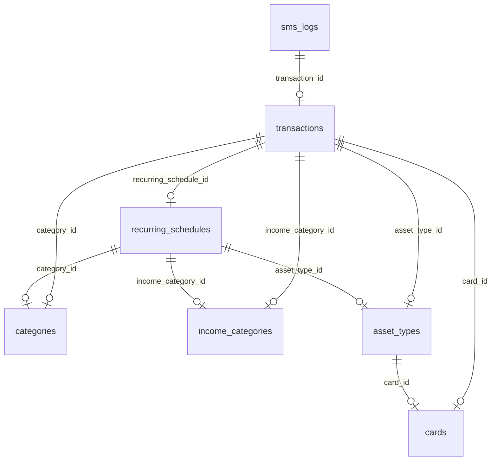

# MyFin Ledger 데이터베이스 설계 문서

이 문서는 MyFin Ledger 애플리케이션의 데이터베이스 구조와 스토리지 설계를 기술합니다. 이 문서는 시스템 분석 및 향후 개발 시 다른 에이전트나 개발자가 참조할 수 있도록 작성되었습니다.

## 1. 개요
- **DBMS**: SQLite 3
- **위치**: `data/db.sqlite3` 또는 `myfin_ledger/db.sqlite3`
- **관리 도구**: `sqlc`를 사용하여 Go 코드를 생성하며, `migrations` 테이블을 통해 스키마 버전을 관리합니다.

## 2. 테이블 구조 요약

### 2.1 핵심 가계부 데이터

#### `transactions` (거래 내역)
가계부의 가장 핵심적인 테이블로, 모든 수입과 지출 내역을 저장합니다. v2.0 업데이트를 통해 수입/지출 통합 관리 및 자산 유형 연동 기능이 추가되었습니다.

| 컬럼명 | 타입 | 설명 |
| :--- | :--- | :--- |
| `id` | INTEGER | 기본 키 (Auto Increment) |
| `tx_type` | TEXT | 거래 유형 (`expense`: 지출, `income`: 수입) |
| `asset_type_id` | INTEGER | 자산 유형 ID (`asset_types` 참조) |
| `card_id` | INTEGER | (Legacy) 카드 ID (`cards` 참조, NULL 허용) |
| `category_id` | INTEGER | 지출 카테고리 ID (`categories` 참조, 지출일 때만 사용) |
| `income_category_id` | INTEGER | 수입 카테고리 ID (`income_categories` 참조, 수입일 때만 사용) |
| `transaction_date` | TIMESTAMP| 거래 발생 일시 |
| `description` | TEXT | 거래 내용/상세 |
| `amount` | INTEGER | 거래 금액 (원 단위) |
| `is_installment` | INTEGER | 할부 여부 (1: 할부, 0: 일반) |
| `installment_months` | INTEGER | 총 할부 개월 수 |
| `installment_current`| INTEGER | 현재 할부 회차 |
| `original_amount` | INTEGER | 할부 원금 총액 |
| `is_cancelled` | INTEGER | 취소된 거래 여부 (1: 취소, 0: 정상) |
| `is_recurring` | INTEGER | 반복 거래 여부 (1: 반복 생성됨, 0: 일반) |
| `recurring_schedule_id` | INTEGER | 생성된 반복 일정 ID (`recurring_schedules` 참조) |
| `memo` | TEXT | 사용자 메모 |
| `created_at` | TIMESTAMP| 데이터 생성 일시 |

#### `asset_types` (자산/결제수단 유형)
지출이나 수입이 발생하는 경로를 정의합니다. 카드뿐만 아니라 현금, 이체 등 다양한 수단을 관리합니다.

- **주요 필드**: `name`, `type` (expense/income), `is_card` (카드 여부), `card_id` (연결된 카드 ID), `is_recurring` (고정 지출/수입 여부)

#### `cards` (카드사 정보)
시스템에서 지원하는 카드사 목록입니다.

- **주요 필드**: `name`, `billing_start_day` (결산 시작일), `billing_end_day` (결산 종료일)

#### `categories` & `income_categories` (분류)
- `categories`: 지출 카테고리 (쇼핑, 식비, 의료 등). `keywords` 필드를 통해 SMS 자동 파싱 시 매칭에 사용됩니다.
- `income_categories`: 수입 카테고리 (급여, 용돈, 부수입 등).

### 2.2 자동화 및 연동 데이터

#### `recurring_schedules` (반복 거래 일정)
매월 반복되는 고정 지출이나 수입을 자동으로 생성하기 위한 스케줄러 설정입니다.

- **주요 필드**: `day_of_month` (반복 일자), `amount`, `description`, `tx_type`

#### `sms_logs` (SMS 수신 로그)
아이폰 단축어 등을 통해 수신된 SMS 텍스트와 파싱 결과를 기록합니다.

- **주요 필드**: `raw_text`, `status` (received, parsed, saved, error), `transaction_id` (연결된 거래 ID)

#### `api_keys` (API 인증)
단축어 등 외부 연동을 위한 인증 키의 해시값을 저장합니다.

### 2.3 기타 설정 및 통계

- `monthly_goals`: 월별 소비 목표 금액 설정.
- `app_settings`: 앱 설정 (예: 가계부 합산 기간 시작일/종료일).
  - `ledger_period_start_day` / `ledger_period_end_day`: 앱 대시보드에서 보여줄 한 달의 기준 기간을 설정합니다. (카드의 결제일과는 무관하게 가계부 전체의 합산 기준이 됩니다.)
- `visitors`: 대시보드 방문자 통계 관리.
- `migrations`: DB 스키마 버전 관리.

## 3. 테이블 관계도 (ERD)

## 4. DB 연결 및 사용 방식 (Architecture)

1. **SQLC 연동**: `db/queries/*.sql` 파일에 정의된 쿼리를 바탕으로 `db/dbgen/` 폴더에 Go 코드가 자동 생성됩니다.
2. **동적 쿼리**: 수입/지출 통합 조회 및 통계 쿼리는 주로 `transactions` 테이블을 기준으로 `JOIN`을 사용하여 수행됩니다.
3. **데이터 무결성**: 외래 키(Foreign Key) 제약 조건을 통해 데이터 무결성을 유지하며, SQLite의 `ON CONFLICT` 구문을 활용해 원자적인 Upsert 작업을 수행합니다.

## 5. 설계 특징 (V2.0 변화)
- **통합 관리**: 기존에는 지출 위주의 `cards` 중심 설계였으나, v2.0에서는 `tx_type`과 `asset_types`를 통해 수입과 모든 형태의 자산 흐름을 관리할 수 있도록 확장되었습니다.
- **유연한 자산 관리**: `asset_types`는 실제 카드(`is_card=1`)일 수도 있고, 단순한 현금 흐름(`is_card=0`)일 수도 있어 확장성이 높습니다.
- **자동화 중심**: `recurring_schedules`와 `sms_logs`를 통해 사용자의 수동 입력을 최소화하고 데이터를 자동으로 수집하는 구조를 지향합니다.
